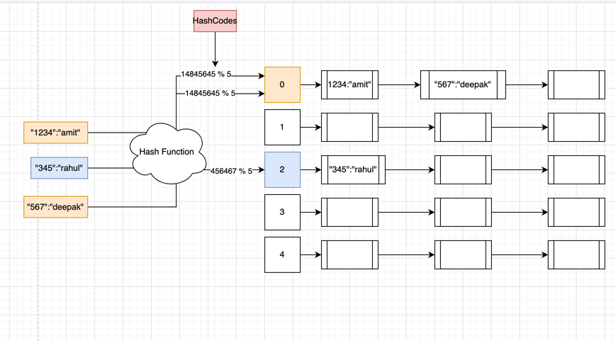
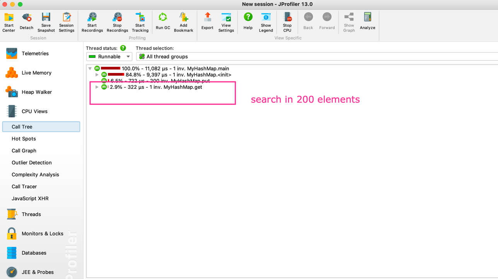
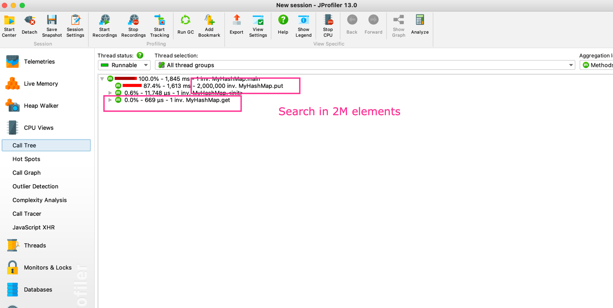

# Custom HashMap in Java 

## Concepts to understand
To implement the custom HashMap, you should have the understanding of the following topics. 
1. Understanding of `Generics` in java
2. Understanding of the Hashmaps concepts like 
   1. What is `hashcode` 
   2. What is `hash table`
   3. What are `buckets` in hashtable
   4. What is `hash collision`.
   

Let's get started

### Generics in Java 
Generics in java are the classes or interfaces which are parameterized over types. It means that instead of specifying the 
type of the class or interface at the time of implementation, let `caller` create the object of desired type. 

For example - Fixed Type object is `MyArrayList<Integer>`, while generic type is `MyArrayList<E>` or `MyArrayList<?>`.
If the type is fixed like `MyArrayList<Integer>` then I can not create the object of `MyArrayList` which can hold `string` values. 

While in the case of `MyArrayList<?>` or `MyArrayList<E>`, I can create object of `MyArrayList` which can hold items of different types like 
`Integer` or `String` or anything else like this `new MyArrayList<Integer>()`, `new MyArrayList<String>()`. 

### What is hashtable
Below is the architecture of the hashtable where resolutions of the collision are resolved by open hashing  


Hashtable consist of 
1. Hash function which take the key and do some calculations to generate the hashcode 
2. Hashcode, it is the output of the hash function for a given key
3. Bucket, it is the index of the `ArrayList` where this key is supposed to be stored. Bucket is calculated by `hashCode % ArrayList.size()` 
4. LinkedList, it is associated with every bucket, it is used to resolve hash collision i.e the cases where two or more keyvalues need to be stored in the same bucket.

### What is hashcode and hash function
Hashcode is the integer value which is returned by a hasCode function. This hashcode function, do some kind of complex calculation
on the object( it could be integer, string, or any other object ). The most noticeable feature of this hashcode is - it will remain same for the given object, 
howmany times you run `hashcode` function on that object. This hashcode unique for a given string. In some cases, if two different objects
have the same `hashcode`, it is known as hashcode collision. 

A quick example of hashCode function could be 
```java
class Hash{
    public void hashCode( int i, long l){
        int result = 1;
        int result = 31 * result + i;
        int result = 31 * result + (l & l >>> 32);
        return result;
    }
}

```

### What is buckets in hashmaps 
Buckets in the hashmap are usually implemented by `ArrayList`. It is because once we get the bucket number in which particular key is present
we need to get it in O(1) operation, it is possible only by getting key by index. 
In most of the implementation, while initializing the hashmap, bucket list of default size is created like below

```java
class HashTable{
   LinkedList<Map<K,V>> ll = new LinkedList<Map<K,V>>();
   ArrayList<ll> hashTable = new ArrayList<ll>();    
}
```

### What is hash collision 
Hash collision is the situation when two or more keys fall in the same bucket. Hash collision happen in the following cases
1. When a hash function generate same hashcode for two different keys
2. When a hash function generate two different keys BUT when we do `hashCode % ArrayList.size()` then we get the same bucket. 

### Implementation of custom hashmaps
 
```java

import java.util.*;

public class MyHashMap<K, V>{

    final static int INIT_CAPACITY = 1000;

    ArrayList<LinkedList<HashMap<K, V>>> hashTable = new ArrayList<>();

    public MyHashMap(){
            createHashTable(this.hashTable);
    }

    private void createHashTable(ArrayList<LinkedList<HashMap<K, V>>> hashTable){

        for(int i = 0; i < MyHashMap.INIT_CAPACITY; i++){
            LinkedList<HashMap<K,V>> ll = new LinkedList<>();
            hashTable.add(ll);
        }
    }

    public void put(K key, V value){

        int hashCode = Math.abs(key.hashCode());
        int bucket = hashCode % hashTable.size();

        LinkedList<HashMap<K,V>> ll = hashTable.get(bucket);

        HashMap<K,V> keyValue = new HashMap<>();
        keyValue.put(key, value);
        ll.add(keyValue);
    }

    public V get(K key){

        boolean isFound = false;
        V value = null;
        int hashCode = Math.abs(key.hashCode());
        int bucket = hashCode % hashTable.size();

        LinkedList<HashMap<K,V>> ll = hashTable.get(bucket);

        for (HashMap<K, V> keyValue : ll) {
            for(HashMap.Entry<K, V> entry: keyValue.entrySet()){
                if(entry.getKey().equals(key)){
                    value = entry.getValue();
                    isFound = true;
                }
            }
            if (isFound) break;
        }
        return value;
    }

    public void displayHashTable(){

        for (int i=0; i<hashTable.size(); i++){
            LinkedList<HashMap<K,V>> ll = hashTable.get(i);
            Iterator<HashMap<K,V>> it = ll.iterator();

            System.out.println("Bucket is " + i);
            while(it.hasNext()){
                System.out.println(it.next());
            }
        }
    }

    public static void main(String args[]){

        MyHashMap<Integer, Integer> myHashMap = new MyHashMap<>();

        for(int i=0; i<2000000; i++){
            myHashMap.put(i, i);
        }
        myHashMap.displayHashTable();

        Object v = myHashMap.get(908);
        System.out.println(v);

        v = myHashMap.get(1);
        System.out.println(v);

        v = myHashMap.get(1000);
        System.out.println(v);


        System.out.println(v);
        System.out.println(v);

    }
}


```

### Performance of HashMap 
_Disclaimer_ : For all performance related stuff, I use JProfiler extensively. You can get it from [Get JProfiler](https://www.ej-technologies.com/products/jprofiler/overview.html)

Time complexity of the search and delete of the hashmap is usually O(1) i.e. it should not increase with the increase in the number of elements. 
Basically if you see the steps being taken to search a key say `KEY` are 
1. Create the hash of `KEY` say `hashcode`
2. Calculate modulus of `hashcode % number of buckets` say `bucketId`
3. Access the bucket with index i.e `bucketId`
4. Search for the elements in the linkedList present in the `bucketid`
   1. If there are no collisions then LinkedList would contain just one key value pair
   2. If there are multiple collisions then LinkedList might contain multiple elements 
      1. Like I said earlier also, collision are bound to happen 
         1. Collision based on same hash value for two different keys 
         2. Collision because of limitation on number of buckets, hence two or more keys even with different hashcode need to reside in same bucket

#### Validation of search time complexity 

##### Hashmap has 200 elements 

Bucket Size : 1000 

```java
class Test{
   public static void main(String args[]) {

      MyHashMap<Integer, Integer> myHashMap = new MyHashMap<>();

      for (int i = 0; i < 200; i++) {
         myHashMap.put(i, i);
      }
      myHashMap.displayHashTable();

      Object v = myHashMap.get(100);
      System.out.println(v);
   }    
}

        

```

**Output**

Time taken to get a element from 200 elements is approx 300 micro secs 



##### Hashmap has 2M elements

Bucket Size : 1000

```java
class Test{
   public static void main(String args[]) {

      MyHashMap<Integer, Integer> myHashMap = new MyHashMap<>();

      for (int i = 0; i < 2000000; i++) {
         myHashMap.put(i, i);
      }
      myHashMap.displayHashTable();

      Object v = myHashMap.get(100);
      System.out.println(v);
   }    
}

        

```
**Output**



Time taken to get a element from 2M elements is approx 600 micro secs. You might be wondering why there is a jump of even 300 micro seconds when searching for a element in 2M elements. 
Reason for this is the constant bucket size. If you take a look at the first use case, we have bucket size of 1000, while in this case also the bucket size is same, hence in this case we would have 
more collisions ( due to hashCode % num of buckets ), then more toward linear search. 

Generally, we should increase the number of buckets dynamically as more and more keys are getting inserted. 


